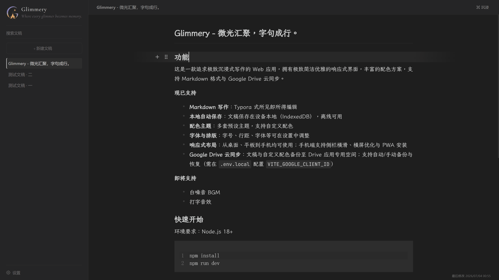
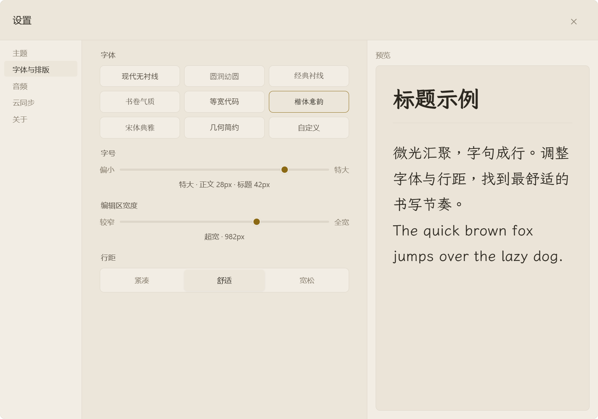
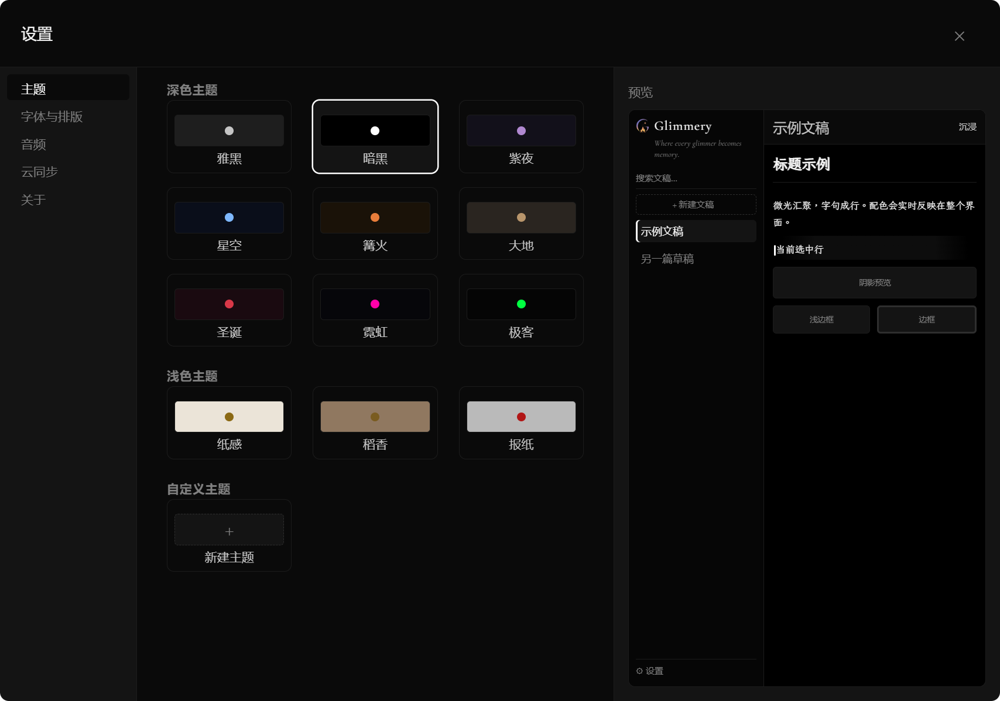
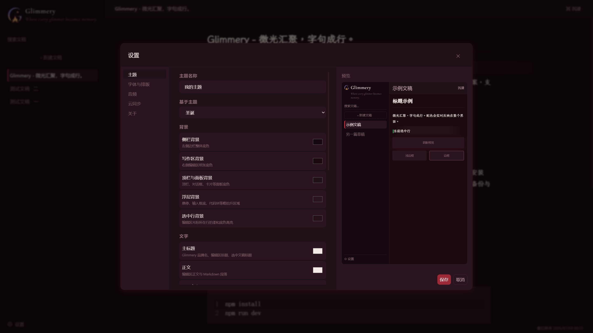

<p align="center">
  
</p>

# Glimmery

*Where every glimmer becomes memory.*

*微光汇聚，字句成行。*

「微光汇聚，字句成行」——做极致的减法，让创作的空间中只有创作。愿你的灵感微光，都能融汇成美好的记忆，留在这里。

<p align="center">
  
</p>

## 功能

这是一款追求极致沉浸式写作的 Web 应用，拥有极致简洁优雅的响应式界面，丰富的配色方案，支持 Markdown 格式与 Google Drive 云同步。

**现已支持**

- **Markdown 写作**：Typora 式所见即所得编辑
- **本地自动保存**：文稿保存在设备本地（IndexedDB），离线可用
- **配色主题**：多套预设主题，支持自定义配色
- **字体与排版**：字号、行距、字体等可在设置中调整
- **响应式布局**：从桌面、平板到手机均可使用；手机端支持侧栏横滑、横屏优化与 PWA 安装
- **Google Drive 云同步**：文稿与自定义配色备份至 Drive 应用专用空间；支持自动/手动备份与恢复（需在 `.env.local` 配置 `VITE_GOOGLE_CLIENT_ID`）

**即将支持**

- 白噪音 BGM
- 打字音效

## 效果预览

<p align="center">
  
</p>

<p align="center">
  
</p>

<p align="center">
  
</p>

## 快速开始

环境要求：Node.js 18+

```bash
npm install
npm run dev
```

浏览器访问 `http://localhost:5173`。局域网内其他设备可通过终端显示的 Network 地址访问。

如需启用 **Google Drive 云同步**，在项目根目录创建 `.env.local`（参见 `.env.example`），填入 OAuth 客户端 ID 后重启开发服务器：

```env
VITE_GOOGLE_CLIENT_ID=你的客户端ID.apps.googleusercontent.com
```

## 部署

构建产物输出到 `dist/`，将目录托管为静态站点即可。

### 自建（站点根路径）

```bash
npm run build
npm run preview   # 本地预览，可选
```

默认 `base` 为 `/`。若需修改，在项目根目录创建 `.env` 并设置 `VITE_BASE_PATH`（参见 `.env.example`）。

若需云同步，在同一 `.env` 中一并设置 `VITE_GOOGLE_CLIENT_ID`，再执行 `npm run build`（变量在构建时注入前端）。

### GitHub Pages（子路径 `/Glimmery/`）

```bash
npm run build:pages
```

`build:pages` 使用 Vite 的 `pages` 模式，需在项目根目录提供 `.env.pages`（已 gitignore），例如：

```
VITE_BASE_PATH=/Glimmery/
VITE_GOOGLE_CLIENT_ID=你的客户端ID.apps.googleusercontent.com
```

将 `dist/` 内容发布到 Pages 即可。

### Google Drive 云同步（可选）

云同步为可选功能；未配置 `VITE_GOOGLE_CLIENT_ID` 时，本地写作与自动保存不受影响。

1. 在 [Google Cloud Console](https://console.cloud.google.com/) 创建项目，启用 **Google Drive API**，配置 OAuth 同意屏幕。
2. 创建 **Web 应用** 类型的 OAuth 客户端 ID，在 **已授权的 JavaScript 来源** 中加入所有实际访问地址，例如：
   - `http://localhost:5173`（本地开发）
   - `https://<用户名>.github.io`（GitHub Pages）
   - `https://你的自建域名`（自建部署）
3. 将客户端 ID 写入对应环境文件（`.env.local` / `.env` / `.env.pages`），变量名均为 `VITE_GOOGLE_CLIENT_ID`。
4. 开发环境修改后需重启 Vite；生产环境需在 **构建前** 写入变量并重新 `npm run build`。

OAuth 应用处于测试阶段时，须在同意屏幕中将使用的 Google 账号加入 **测试用户** 列表。
